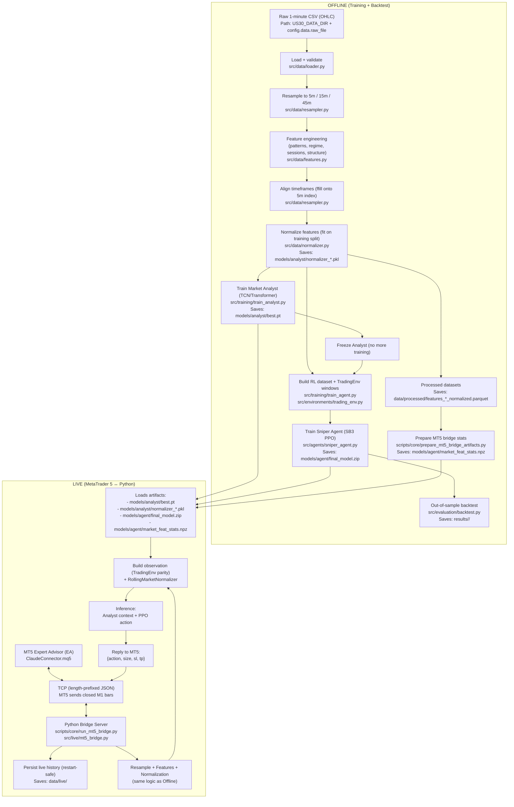
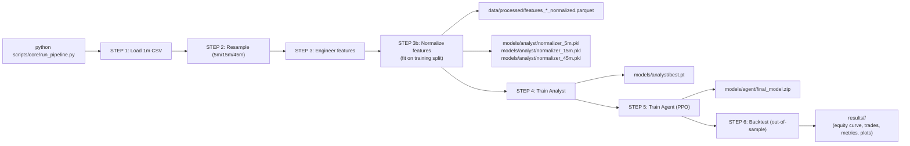

# US30 Hybrid AI Trading System (Training → Backtest → Live MT5 Bridge)

This repository contains an end-to-end trading system for US30 that can:

- Train a **Market Analyst** (supervised deep learning) to learn market context from multi‑timeframe features.
- Train a **Sniper Agent** (reinforcement learning / PPO) to decide when to **BUY / SELL / HOLD**.
- Backtest the trained agent out-of-sample and write a full report to `results/`.
- Run a **live MT5 ↔ Python bridge** so MetaTrader 5 can request decisions from the trained models in real time.

Important: this project is research software. Live trading is risky and can lose money.

---

## What you get (plain-English overview)

Think of the system as two “brains” working together:

1) **Market Analyst (Supervised Model)**  
   Learns from historical candles (price bars) and engineered indicators.  
   Its job is to compress “what the market looks like right now” into a **context vector**.

2) **Sniper Agent (RL Model)**  
   Uses the Analyst context + extra market state (ATR/ADX/session flags/etc.) to decide:
   - whether to trade (or stay flat)
   - trade direction (long/short)
   - position size (scaled)

Then you can:
- **Backtest** (simulate trades on unseen data) to see how it would have performed.
- Run **Live Mode** by connecting MetaTrader 5 to Python via a TCP bridge.

---

## Architecture and pipeline diagrams

These diagrams show how the whole system fits together.
If your Markdown viewer does not render Mermaid diagrams, view this README on GitHub (or any Mermaid-capable viewer).

### End-to-end architecture (offline + live + optional UI)



### The pipeline you run (`python scripts/core/run_pipeline.py`)



---

## Repository structure (where things are)

Core code:

- `config/settings.py` — the central configuration (paths, hyperparameters, trading rules).
- `src/data/` — CSV loading, resampling, feature engineering, normalization.
- `src/models/` — Analyst architectures (TCN/Transformer) + encoders/fusion.
- `src/environments/` — Gymnasium trading environment used to train/evaluate the RL agent.
- `src/agents/` — wrappers around SB3 PPO (and an experimental recurrent agent).
- `src/training/` — Analyst training loop + Agent training helpers.
- `src/evaluation/` — backtest engine + metrics and reporting.
- `src/live/` — the MT5 bridge server.
- `tests/` — test suite (including parity tests: training ↔ live bridge).

Entry points (what you run):

- `scripts/core/run_pipeline.py` — end-to-end pipeline (data → features → normalize → train → backtest).
- `scripts/core/prepare_mt5_bridge_artifacts.py` — creates `models/agent/market_feat_stats.npz` for live parity.
- `scripts/core/run_mt5_bridge.py` — starts the TCP server that MT5 connects to.

Artifacts (files the system generates):

- `data/processed/` — engineered + normalized parquet files.
- `models/analyst/` — Analyst checkpoint + feature normalizers.
- `models/agent/` — PPO model zip + live normalization stats.
- `results/` — backtest outputs (metrics, equity curves, trade logs, plots).

---

## Prerequisites

### Required software

- Python 3.10+ (recommended)
- `pip` (comes with Python)
- (For live trading) MetaTrader 5 + MetaEditor (Windows, or MT5 via a Windows VM)

### Required data (for training/backtesting)

You need a **1-minute OHLC** CSV (candles/bars) with at least these columns:

- `datetime` (or `timestamp` / `time` / `date`)
- `open`, `high`, `low`, `close`

The pipeline loads the CSV from:

- Folder: `US30_DATA_DIR` environment variable, or default `~/Desktop/Oanda data`
- Filename: `config.data.raw_file` (default: `ATLAS_MT5_UTC.csv`)

So the default expected path is:

`~/Desktop/Oanda data/ATLAS_MT5_UTC.csv`

You can change this without editing code (recommended) by setting:

```bash
export US30_DATA_DIR="/full/path/to/your/data/folder"
```

---

## Install (first time)

From the repo root:

```bash
python -m venv .venv
source .venv/bin/activate
pip install -r requirements.txt
```

Notes:
- Training is optimized for Apple Silicon and uses `torch` MPS when available.
- Some tasks write Parquet files; `pyarrow` is required (already in `requirements.txt`).

---

## Quickstart: run the full pipeline (training + backtest)

1) Put your 1-minute CSV where the config expects it (recommended: set `US30_DATA_DIR`).
2) Run:

```bash
python scripts/core/run_pipeline.py
```

What this does:

1. Loads your 1-minute candles
2. Resamples to **5m / 15m / 45m**
3. Engineers features (patterns, regime, structure, sessions, etc.)
4. Saves feature Parquets to `data/processed/`
5. Fits and saves feature normalizers to `models/analyst/normalizer_*.pkl`
6. Trains the Analyst and saves it to `models/analyst/best.pt`
7. Trains the Agent and saves it to `models/agent/final_model.zip`
8. Runs an out-of-sample backtest and writes outputs to `results/<timestamp>/`

---

## Common commands (copy/paste)

### Full pipeline

```bash
python scripts/core/run_pipeline.py
```

### Train Analyst only

```bash
python scripts/core/run_pipeline.py --analyst-only
```

### Train Agent using an existing Analyst (skip Analyst training)

```bash
python scripts/core/run_pipeline.py --skip-analyst
```

### Backtest only (requires existing processed data + trained models)

```bash
python scripts/core/run_pipeline.py --backtest-only
```

### Backtest a specific agent model zip

```bash
python scripts/core/run_pipeline.py --backtest-only --model-path models/agent/final_model.zip
```

### Set a minimum confidence threshold in backtest

```bash
python scripts/core/run_pipeline.py --backtest-only --min-confidence 0.2
```

### Resume agent training from a checkpoint

```bash
python scripts/core/run_pipeline.py --skip-analyst --resume models/checkpoints/<your_checkpoint>.zip
```

---

## Live trading: MT5 ↔ Python bridge

Live mode mirrors training/backtest as closely as possible:

- MT5 sends **closed 1-minute bars** to Python
- Python rebuilds **5m / 15m / 45m** bars using the same resampling semantics as training
- Python runs the same feature engineering + saved normalizers
- Python runs Analyst + Agent inference and replies with an action for MT5

### Step 1 — Make sure you have trained artifacts

You need these files before live mode can work:

- `models/analyst/best.pt`
- `models/analyst/normalizer_5m.pkl`
- `models/analyst/normalizer_15m.pkl`
- `models/analyst/normalizer_45m.pkl`
- `models/agent/final_model.zip`

If you don’t have them yet, run:

```bash
python scripts/core/run_pipeline.py
```

### Step 2 — Build MT5 bridge artifacts (one-time per new model/data)

This creates `models/agent/market_feat_stats.npz` which the live bridge uses to normalize
market features exactly like the training environment.

```bash
python scripts/core/prepare_mt5_bridge_artifacts.py
```

### Step 3 — Start the Python bridge server

```bash
python scripts/core/run_mt5_bridge.py --host 127.0.0.1 --port 5555 --symbol US30
```

Useful options:

- Dry run (compute decisions but never trade): `--dry-run`
- Change history folder (saved live M1 bars): `--history-dir data/live`
- Turn on bridge debug logs: `--debug`

### Step 4 — Attach the MT5 Expert Advisor (EA)

1) Open MetaEditor
2) Compile `ClaudeConnector.mq5`
3) In MetaTrader 5, attach the EA to the chart (symbol must match `--symbol`)
4) Set `ServerHost` and `ServerPort` in the EA inputs to match the Python bridge

If everything is correct, the EA will:
- send bar updates to Python
- receive actions (buy/sell/hold + size/SL/TP)

More detail: `MT5_BRIDGE.md`

---

## Visualization and analysis scripts (optional)

There are extra scripts in `scripts/`:

- `scripts/visualization/` — plots equity curves, monthly heatmaps, candlesticks, etc.
- `scripts/backtest/` — alternative backtests (monthly backtest, Monte Carlo, checkpoint scans).
- `scripts/analysis/` — diagnostics (gap removal checks, feature contribution, etc.).
- `scripts/monitoring/` — training monitors.

Examples:

```bash
# Plot equity curve + drawdown for a specific backtest folder
python scripts/visualization/visualize_backtest.py results/<timestamp>/

# Run Monte Carlo backtest (see script for args)
python scripts/backtest/monte_carlo_backtest.py --help
```

---

## Tests

Run all tests:

```bash
pytest tests/
```

Parity test (training ↔ live bridge feature/obs alignment):

```bash
pytest tests/test_parity.py -v
```

---

## Troubleshooting (common issues)

### “Data file not found”

The pipeline exits if it can’t find the CSV at:

`<US30_DATA_DIR>/<config.data.raw_file>`

Fix:

```bash
export US30_DATA_DIR="/full/path/to/the/folder/that/contains/your/csv"
```

Or edit `config/settings.py`:
- `PathConfig.training_data_dir`
- `DataConfig.raw_file`

### “Unable to find a usable engine; tried using: 'pyarrow', 'fastparquet'”

This means Parquet support isn’t installed.

Fix:

```bash
pip install -r requirements.txt
```

### MT5 connects but no trades happen

Common reasons:

- Not enough warmup history yet (bridge requires a minimum number of M1 bars / days)
- Bridge is in `--dry-run` mode
- The EA symbol/time settings don’t match `--symbol`

---

## Where to change things

- Data paths / filenames / timeframes / hyperparameters: `config/settings.py`
- Feature engineering logic: `src/data/features.py`
- Trading environment + reward shaping: `src/environments/trading_env.py`
- Analyst model selection (TCN vs Transformer): `config/settings.py` (`analyst.architecture`)
- Live bridge behavior: `src/live/mt5_bridge.py`
